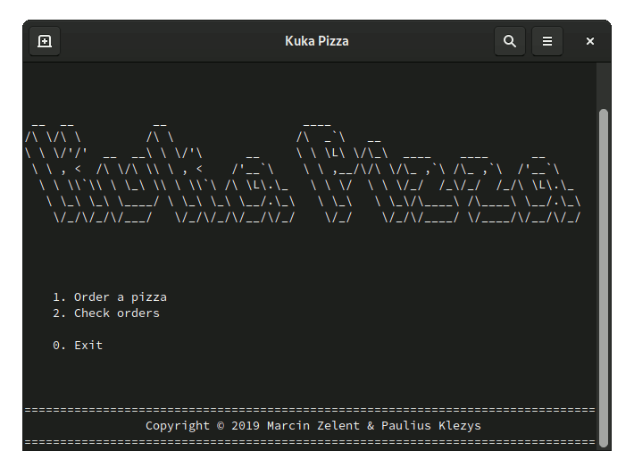
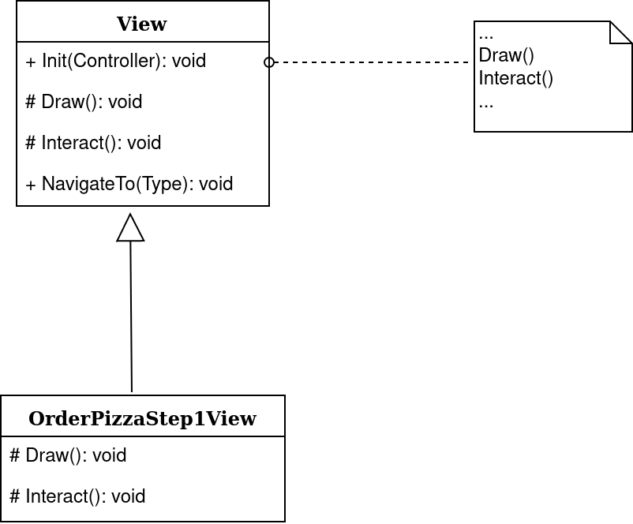
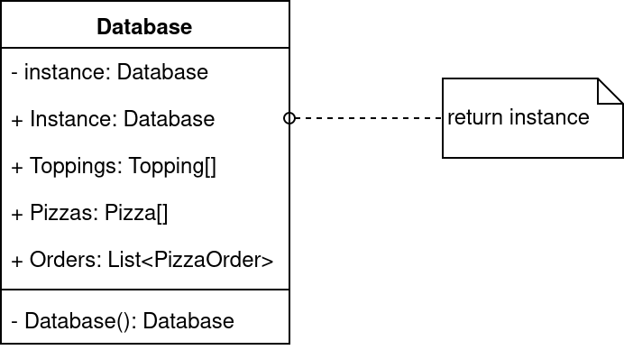
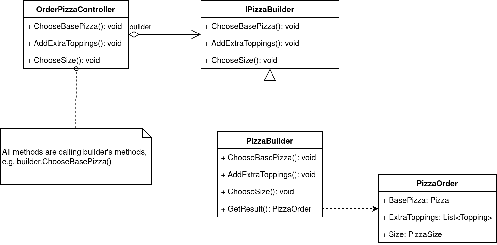
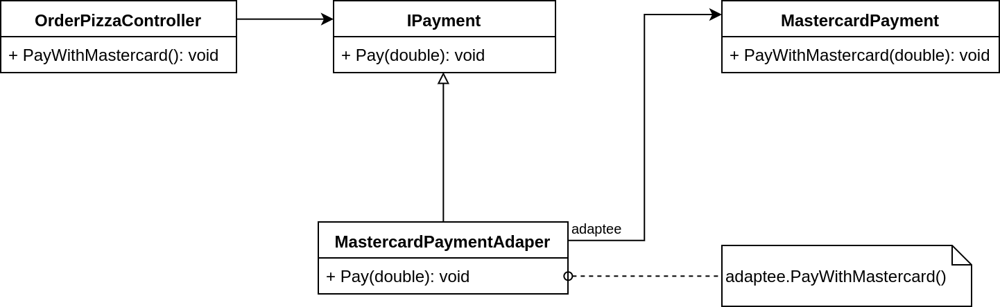

# Kuka Pizza

A simple console program for ordering pizza that implements software design patterns used in object oriented programming. Final assignment of Software Design Patterns course at KEA - Københavns Erhvervsakademi.

## Preview

## 1. Introduction

Our final task in the Software Design Patterns course was to create a program in an object-oriented programming language that would include four design patterns that we have learned during the lessons.

I decided to develop the program in C# because it is the language I was taught before and am most familiar with it. Together with it, I used .NET Core that is a free and open-source, cross-platform framework, commonly used with C#.

The program I have created is a simple console application that simulates a pizza ordering software. I decided to realize this idea because I believed that this kind of project would allow me to implement some design patterns in a similar way they would be in a real-life scenario. My focus during the development was on the patterns, therefore the application is not that rich in terms of functionality.

The program’s features include ordering of pizza and displaying the list of previously ordered pizzas. When the user opens the program, he/she is greeted with a welcoming screen that allows accessing these two features. To navigate in the application, the user has to press number keys corresponding to the option on the screen, or type the full number and press the enter key. Upon selecting the first option, “Order a pizza”, the user starts a step-by-step process of ordering. The first question is what should be the base of the requested pizza. Then, the user can choose some additional toppings on the pizza. The third step is to choose what should be the size of the pizza. On the last screen, the user is shown the final order, as created in the previous steps, and asked for confirmation whether it is correct. When the user selects the “yes” option, he/she is taken back to the welcoming screen. If the user chooses the second option there, he/she can see the order on the list.

## 2. Design patterns used

The patterns to be used were not completely obvious before the development started. For example, I expected that for the creation of pizzas, I will use some creational patterns like Factory, Builder, or Prototype. Some of the patterns became apparent only during the work after some problems appeared. Then, I would stop to think of the pattern I could use to solve them. Surprisingly, I also managed to implement a pattern first, without realizing it. After all, the patterns I used are the following: Template Method, Singleton, Builder, and Adapter.

One of the first issues was how to create nice navigation within the application with each screen being encapsulated. I came up with an idea to create an abstract class that would have some methods that could be used universally on all the screens, e.g. for navigation, and methods that are specific to the screen, i.e. for drawing and user input. Then, I created all the screens based on that class. Only after some time, I realized that I have in fact used the Template Method pattern.

Another issue was that I needed something to hold the data on available pizzas and toppings. Something that could be accessible anywhere and unique. I could use a database or a file but because it was supposed to be a simple program, I decided to solve it differently. The perfect solution for this kind of problem is a Singleton. It can have only one instance, so I could make sure that I am always using the same objects I created inside it, and that they are persistent and easily accessible.

The creation of a pizza was a problem that I decided to solve with a Builder pattern. I chose it because the making of a pizza order is a more complex task that consists of multiple steps that require user input. That is exactly the purpose of the Builder pattern. The Factory pattern might seem similar but in comparison to it but it requires the entire object to be built in a single method call, with all the parameters passed in on a single line, which I could not do because I wanted to create the pizza in smaller steps.

The last issue did not occur naturally but was created by me to show a problem that could happen while working on a real program. After the pizza order is made, the user is asked to confirm it and pay. He/she has two possibilities: to pay with Visa, or with MasterCard. Let’s say the Visa was implemented first and the code was based on the methods provided by the Visa library. Then, I wanted to add MasterCard support but it turned out its library is not compatible with the payment logic inside the application. To solve this problem, I used the Adapter pattern.

### 2.1. Template Method

I use the Template Method pattern to create all the views within the application and easily navigate between them. I created an abstract class **View** that has two methods that have no body but need to be implemented in any class that inherits **View**: **Draw()** and **Interact()**. The first one is used to draw the user interface and information in the console. The second one is used for getting user input. Because on all of the views, the printed information, as well as the possible options, may vary, they need to be implemented in the concrete classes such as **OrderPizzaStep1View**. However, all of the views should have some methods that will always work in the same way. These methods are: **Init(Controller)** and **NavigateTo(Type)**. Both of them are implemented in the abstract **View** class and are used in the concrete classes. **Init(Controller)** initializes the view, i.e. draws it and starts the listener for user input. As the name suggests, **NavigateTo(Type)** allows for navigation between the views.

So, the Template Method helped me avoid code duplication because I could have some universal methods, and at the same time, allowed me to have varying behavior for the specific concrete classes.

### 2.2. Singleton

I used the Singleton to create a fake database that would allow some data like **Toppings**, **Pizzas**, and **Orders** to be accessible throughout the whole application. Just like in case of a real database, there can be only one instance of **Database** class. Because its constructor is private, it can only be used inside this class. And it is created as a variable **instance** that is then exposed to the outside with **Instance** property. This is a thread-safe implementation with lazy loading, meaning it will only be created when it is accessed for the first time.

### 2.3. Builder

The Builder pattern is a creational pattern that is used for creating complex objects in steps. It separates the construction of a complex object from its representation. In my application, the user has to follow a process consisting of multiple steps to order a pizza. Each of these steps has a corresponding action performed by **PizzaBuilder**. **PizzaBuilder** is an implementation of **IPizzaBuilder** interface. It is the only one, but there could be more. **OrderPizzaController** has an instance of **PizzaBuilder** and when the user chooses options in the application, his/her options are being first sent to the controller which then calls the building methods from the builder. When all the steps are finished, the builder allows to get the final result with **GetResult()** method which returns the **PizzaOrder**.

The Builder pattern isolates code for construction and representation. It allows creating different objects based on some parameters and gives more control over the construction process.

### 2.4. Adapter

I used the Adapter pattern to solve the problem of incompatible interface of **MastercardPayment** with the already existing **IPayment** logic. I wrapped **MastercardPayment** in **MastercardPaymentAdapter** that implements the **IPayment** interface. The adapter simply creates an instance of **MastercardPayment** and calls its **PayWithMastercard(double)** method. This way, I could easily adjust the incompatible class with the rest of the code without making many changes to it.

## 3. Conclusion

During the development of the application, I stumbled upon many issues that I managed to solve with different patterns that match the specific situation. I used Template Method for creation of encapsulated views, Singleton for storing data, Builder for making orders, and Adapter for using incompatible payment library.

The usage of design patterns not only solves the problems when designing applications in object-oriented languages but also help the code to be of high quality, reusable, and properly organized.
